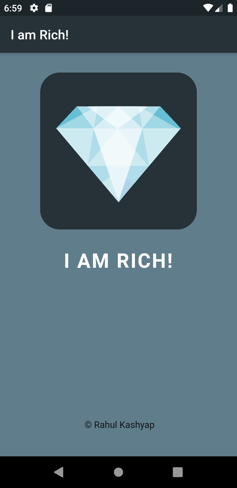

# imrich

* A basic Flutter application to be familiar with flutter and dart.
* The UI of app is inspired from the course of *Angela Yu* over flutter available on Udemy.
* The idea behind developing this app was from an ios developer who created this app and pushed it to Appstore and priced it for the highest price available.Just for the people who consider themselves rich could show their wealth by buying a costly app which does nothing.
And, guess what, the developer made good money.
* Do check and share views.

## Screenshots:

